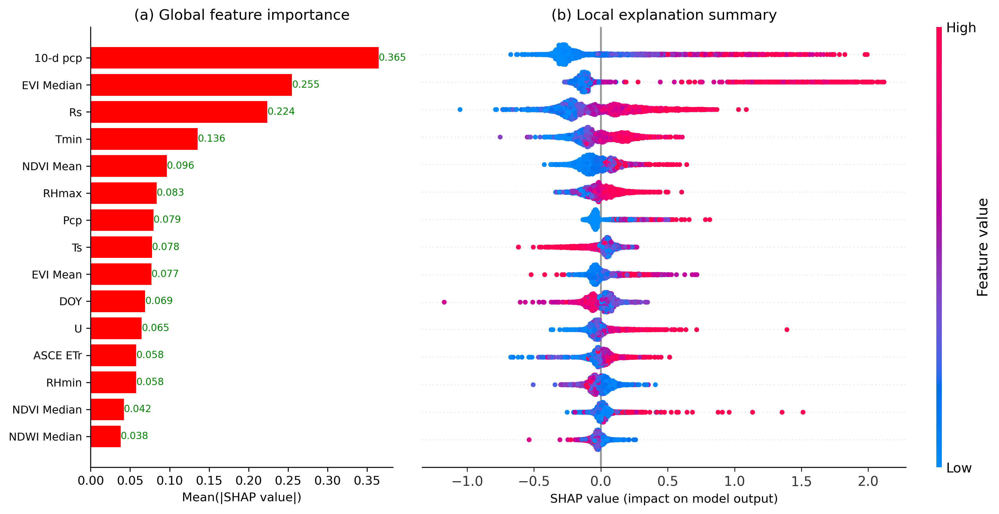
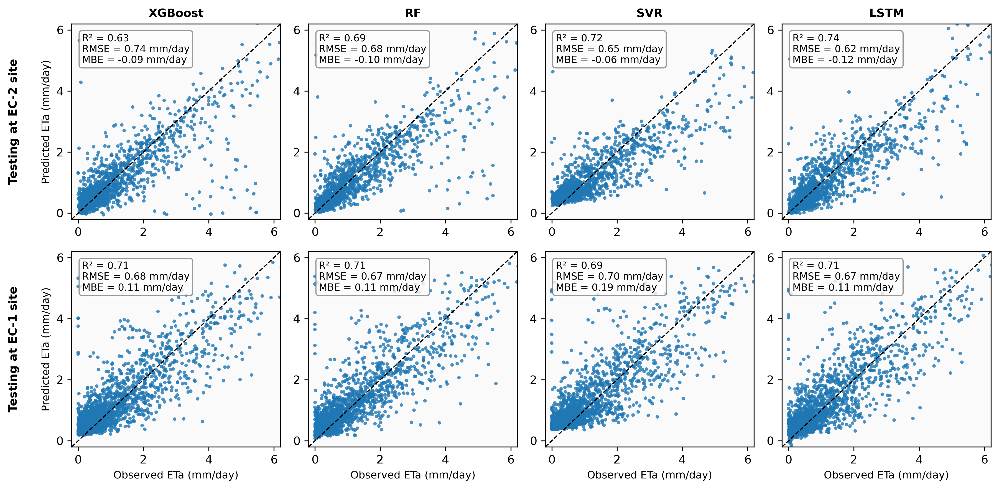
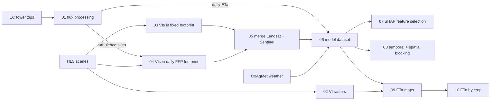

# Daily evapotranspiration in dryland cropping systems with footprint-aware machine learning

Code for the paper:

> Lamichhane, M., Mehan, S., & Mankin, K. R. (2026). Daily actual evapotranspiration estimation in dryland cropping systems using parsimonious machine learning frameworks. *Measurement: Digitalization*, 7, 100044. https://doi.org/10.1016/j.meadig.2026.100044 (open access)

[](https://doi.org/10.1016/j.meadig.2026.100044)
[](LICENSE)


## Overview

Actual evapotranspiration (ETa) is the water a crop field actually loses to the atmosphere. It is the best single measure of crop water use, but it is only measured directly at a few eddy covariance (EC) towers. This project trains ML models on seven years of tower data (2019-2025) from two dryland fields at the USDA-ARS Central Great Plains Research Station (Akron, Colorado), and then uses them to map daily ETa at 30 m resolution.

What the pipeline does:

- **Remote sensing features.** Harmonized Landsat Sentinel-2 (HLS) imagery is cloud-masked and converted to seven spectral indices (NDVI, EVI, SAVI, MSAVI, NDWI, MSI, SR). The indices are summarised over the tower footprint, then gap-filled to a daily series.
- **Footprint-aware extraction.** The daily 90% source area of each tower is estimated with the Kljun et al. (2015) FFP model, so the satellite pixels match the area the tower actually "sees".
- **Feature selection with SHAP.** The 21 candidate predictors are ranked by mean |SHAP| from an XGBoost model. Features are then added one at a time to find where test R² stops improving. Collinear features are dropped, giving a 6-feature and a 3-feature configuration.
- **Four model families.** XGBoost, random forest, SVR and an LSTM, all evaluated on unseen data:
  - **Temporal blocking:** leave-one-year-out over 2019-2025.
  - **Spatial blocking:** train on one tower, test on the other field, which has a different crop rotation.
- **Mapping and analysis.** A final model is applied to daily rasters, and ETa is summarised by crop type (wheat, corn, millet, fallow).

## Key results

Leave-one-year-out performance, averaged over the seven held-out years (RMSE in mm/day):

| Model | 6 features: R² | 6 features: RMSE | 3 features: R² | 3 features: RMSE |
|---|---|---|---|---|
| XGBoost | 0.60 | 0.70 | 0.55 | 0.74 |
| Random forest | 0.64 | 0.66 | 0.58 | 0.71 |
| SVR | 0.64 | 0.68 | 0.57 | 0.74 |
| LSTM | **0.68** | **0.62** | **0.65** | **0.64** |

- Short-term antecedent precipitation (10-day total) was the strongest predictor, followed by EVI and incoming solar radiation. In other words, water, then vegetation, then energy.
- With only these three inputs, the LSTM lost the least accuracy (R² fell 4% versus 8-11% for the other models). It was also the most stable across years and sites.
- In spatial transfer with six features, all models reached R² 0.66-0.72 on the unseen tower.

Feature sets:

- **6 features:** 10-d pcp, EVI median, Rs, Tmin, RHmax, precipitation
- **3 features:** 10-d pcp, EVI median, Rs

<!-- After running notebooks 07 and 08 with the real data, these images will exist: -->
<p align="center">
  <br>
  
</p>

## Pipeline



| Notebook | What it does | Paper output |
|---|---|---|
| `01_ec_flux_processing` | Stacks half-hourly EddyPro output, builds FFP inputs, aggregates daily ETa | - |
| `02_hls_vi_rasters` | Cloud-masked NDVI/EVI rasters, clipped and interpolated to daily | - |
| `03_vi_extraction_fixed_footprint` | Mean and median of 7 indices inside the footprint polygon | - |
| `04_vi_extraction_ffp_climatology` | Same, inside the daily 90% FFP footprint contour | - |
| `05_merge_landsat_sentinel` | One index table per site (Landsat preferred on shared dates) | - |
| `06_build_model_dataset` | Joins ETa, daily indices and weather | - |
| `07_feature_selection_shap` | Correlation, SHAP ranking, stepwise feature addition, RF check | Figs. 4, 5, S1, S2, Table S1 |
| `08_model_evaluation` | Leave-one-year-out and cross-site tests for the 4 models | Tables 3-4, Figs. 6-9 |
| `09_eta_mapping` | Final model applied to the daily rasters (random forest) | - |
| `10_eta_dynamics_by_crop` | ETa time series and monthly totals by crop | Figs. 10, 11 |

Notebooks 01, 03-06 are run once per site (`SITE = "ASP"` or `"BAU"`) and, where relevant, per sensor. Notebook 08 is run once per feature set (`FEATURE_SET = "6"` or `"3"`). Site naming used in the code:

- ASP (aspirational wheat-corn-millet-fallow rotation) is EC-1.
- BAU (business-as-usual wheat-fallow rotation) is EC-2.

## Getting started

```bash
git clone https://github.com/<Manoj-byte343>/dryland-eta-ml.git
cd dryland-eta-ml

conda env create -f environment.yml      # recommended, rasterio/geopandas install cleanly from conda-forge
conda activate dryland-eta
# or: pip install -r requirements.txt

jupyter lab
```

Notebook 04 also needs the FFP model script from https://footprint.kljun.net. It is not redistributed here; see [`src/README.md`](src/README.md).

To reproduce the modelling results only (notebooks 07 and 08), the two files in `data/model_input/` are enough. See [`data/README.md`](data/README.md) for the full folder layout and column descriptions.

## Repository structure

```
dryland-eta-ml/
├── notebooks/        pipeline, run in numeric order
├── data/             inputs (see data/README.md, large files are not tracked)
├── src/              place calc_footprint_FFP_climatology.py here
├── results/
│   ├── figures/      figures written by the notebooks
│   └── tables/       metric and prediction tables
├── environment.yml
├── requirements.txt
└── CITATION.cff
```

## Notes

- Models use fixed seeds (42 for the tree models, 12 for the LSTM). TensorFlow results can still vary slightly between machines and versions.
- Vegetation indices between HLS overpasses are linearly interpolated. This is the main source of uncertainty during fast green-up and right after rain.
- The models were developed at a single research station with two towers. Transfer to other climates has not been tested.

## Citation

If you use this code, please cite the paper (see [`CITATION.cff`](CITATION.cff)):

```bibtex
@article{lamichhane2026eta,
  title   = {Daily actual evapotranspiration estimation in dryland cropping systems using parsimonious machine learning frameworks},
  author  = {Lamichhane, Manoj and Mehan, Sushant and Mankin, Kyle R.},
  journal = {Measurement: Digitalization},
  volume  = {7},
  pages   = {100044},
  year    = {2026},
  doi     = {10.1016/j.meadig.2026.100044}
}
```

Please also cite Kljun et al. (2015), *Geosci. Model Dev.* 8, 3695-3713, for the footprint model.

## Acknowledgements

Supported in part by USDA NIFA Hatch SD00H817-24/SD00R793-26 and Agreement 58-3012-3-019 with USDA-ARS, Water Management and Systems Research Unit, Fort Collins, CO. Thanks to the field crew at the Central Great Plains Research Station for farm operations and data collection.

## Contact

Manoj Lamichhane - <manoj.lamichhane@jacks.sdstate.edu> - [LinkedIn](<www.linkedin.com/in/manoj-lamichhane-ph-d-58455028b>)
